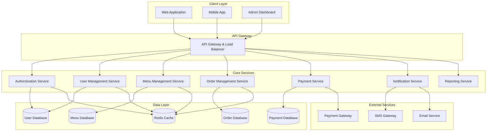

# Design Document - تدبیرخوان (Catering Management System)

## Overview

تدبیرخوان یک سیستم جامع مدیریت کترینگ آنلاین است که با استفاده از معماری microservices طراحی شده تا قابلیت مقیاس‌پذیری، قابلیت اطمینان و نگهداری آسان را فراهم کند. سیستم از الگوی multi-tenant استفاده می‌کند تا بتواند چندین کترینگ را همزمان پشتیبانی کند.

## Architecture

### High-Level Architecture

سیستم بر اساس معماری microservices طراحی شده که شامل سرویس‌های مستقل زیر است:



### Service Decomposition Strategy

سیستم بر اساس business capabilities تقسیم شده:

1. **Authentication Service**: مدیریت احراز هویت و authorization
2. **User Management Service**: مدیریت کاربران، شرکت‌ها و کارمندان
3. **Menu Management Service**: مدیریت منو، غذاها و موجودی
4. **Order Management Service**: مدیریت سفارشات و workflow آن‌ها
5. **Payment Service**: پردازش پرداخت‌ها و مدیریت مالی
6. **Notification Service**: ارسال اعلان‌ها و پیام‌ها
7. **Reporting Service**: تولید گزارش‌ها و آنالیتیک

## Components and Interfaces

### Authentication Service

**مسئولیت‌ها:**
- احراز هویت کاربران (JWT-based)
- مدیریت نقش‌ها و دسترسی‌ها (RBAC)
- Session management و token refresh

**API Endpoints:**
```
POST /auth/login
POST /auth/logout
POST /auth/refresh
GET /auth/profile
PUT /auth/profile
POST /auth/change-password
```

**Dependencies:**
- User Management Service (برای اطلاعات کاربر)
- Redis Cache (برای session storage)

### User Management Service

**مسئولیت‌ها:**
- ثبت‌نام و مدیریت کاربران
- مدیریت شرکت‌ها و کارمندان
- تایید درخواست‌های شرکت‌ها

**API Endpoints:**
```
POST /users/register
GET /users/profile
PUT /users/profile
POST /companies/register
GET /companies/pending
PUT /companies/{id}/approve
PUT /companies/{id}/reject
POST /companies/{id}/employees
GET /companies/{id}/employees
```

**Data Models:**
```typescript
interface User {
  id: string;
  email: string;
  password: string; // hashed
  firstName: string;
  lastName: string;
  phone: string;
  userType: 'individual' | 'company_admin' | 'catering_manager' | 'employee';
  companyId?: string;
  isActive: boolean;
  createdAt: Date;
  updatedAt: Date;
}

interface Company {
  id: string;
  name: string;
  registrationNumber: string;
  address: string;
  contactPerson: string;
  email: string;
  phone: string;
  status: 'pending' | 'approved' | 'rejected';
  adminUserId: string;
  createdAt: Date;
  approvedAt?: Date;
}
```

### Menu Management Service

**مسئولیت‌ها:**
- مدیریت اقلام غذایی
- تعریف منوی روزانه و ماهانه
- مدیریت موجودی و قیمت‌گذاری

**API Endpoints:**
```
POST /menu/items
GET /menu/items
PUT /menu/items/{id}
DELETE /menu/items/{id}
POST /menu/daily
GET /menu/daily/{date}
PUT /menu/daily/{date}
GET /menu/monthly/{year}/{month}
```

**Data Models:**
```typescript
interface FoodItem {
  id: string;
  name: string;
  description: string;
  category: string;
  basePrice: number;
  imageUrl?: string;
  ingredients: string[];
  allergens: string[];
  isActive: boolean;
  createdAt: Date;
}

interface DailyMenu {
  id: string;
  date: Date;
  items: DailyMenuItem[];
  isPublished: boolean;
  createdAt: Date;
}

interface DailyMenuItem {
  foodItemId: string;
  price: number;
  availableQuantity: number;
  soldQuantity: number;
}
```

### Order Management Service

**مسئولیت‌ها:**
- پردازش سفارشات
- مدیریت وضعیت سفارشات
- محاسبه قیمت‌ها و تخفیف‌ها

**API Endpoints:**
```
POST /orders
GET /orders
GET /orders/{id}
PUT /orders/{id}/status
DELETE /orders/{id}
GET /orders/user/{userId}
GET /orders/company/{companyId}
```

**Data Models:**
```typescript
interface Order {
  id: string;
  userId: string;
  companyId?: string;
  orderDate: Date;
  deliveryDate: Date;
  items: OrderItem[];
  totalAmount: number;
  discountAmount: number;
  finalAmount: number;
  status: 'pending' | 'confirmed' | 'preparing' | 'ready' | 'delivered' | 'cancelled';
  paymentStatus: 'pending' | 'paid' | 'failed' | 'refunded';
  notes?: string;
  createdAt: Date;
  updatedAt: Date;
}

interface OrderItem {
  foodItemId: string;
  quantity: number;
  unitPrice: number;
  totalPrice: number;
}
```

### Payment Service

**مسئولیت‌ها:**
- پردازش پرداخت‌ها
- تولید فاکتورها
- مدیریت تراکنش‌های مالی

**API Endpoints:**
```
POST /payments/process
GET /payments/{orderId}
POST /invoices/generate
GET /invoices/{id}
GET /invoices/user/{userId}
GET /invoices/company/{companyId}
```

**Data Models:**
```typescript
interface Payment {
  id: string;
  orderId: string;
  amount: number;
  method: 'credit_card' | 'bank_transfer' | 'wallet';
  status: 'pending' | 'completed' | 'failed' | 'refunded';
  transactionId?: string;
  gatewayResponse?: any;
  createdAt: Date;
  completedAt?: Date;
}

interface Invoice {
  id: string;
  userId: string;
  companyId?: string;
  period: { from: Date; to: Date };
  orders: string[]; // order IDs
  subtotal: number;
  tax: number;
  discount: number;
  total: number;
  status: 'draft' | 'sent' | 'paid';
  pdfUrl?: string;
  createdAt: Date;
}
```

### Notification Service

**مسئولیت‌ها:**
- ارسال اعلان‌های ایمیل و SMS
- مدیریت template های پیام
- پیگیری وضعیت ارسال

**API Endpoints:**
```
POST /notifications/send
GET /notifications/templates
POST /notifications/templates
PUT /notifications/templates/{id}
```

### Reporting Service

**مسئولیت‌ها:**
- تولید گزارش‌های فروش
- آنالیتیک کاربران و سفارشات
- داشبورد مدیریتی

**API Endpoints:**
```
GET /reports/sales/{period}
GET /reports/users/{period}
GET /reports/orders/{period}
GET /reports/company/{companyId}/{period}
GET /reports/dashboard
```

## Data Models

### Database Design Strategy

سیستم از الگوی Database-per-Service استفاده می‌کند:

1. **User Database (PostgreSQL)**: اطلاعات کاربران، شرکت‌ها و کارمندان
2. **Menu Database (PostgreSQL)**: اقلام غذایی و منوهای روزانه
3. **Order Database (PostgreSQL)**: سفارشات و جزئیات آن‌ها
4. **Payment Database (PostgreSQL)**: تراکنش‌ها و فاکتورها
5. **Redis Cache**: Session storage و caching

### Multi-Tenant Data Isolation

برای پشتیبانی از چندین کترینگ، از الگوی Shared Database, Separate Schema استفاده می‌شود:

```sql
-- هر کترینگ یک tenant_id منحصر به فرد دارد
CREATE TABLE tenants (
    id UUID PRIMARY KEY,
    name VARCHAR(255) NOT NULL,
    domain VARCHAR(255) UNIQUE,
    created_at TIMESTAMP DEFAULT NOW()
);

-- تمام جداول اصلی شامل tenant_id هستند
CREATE TABLE users (
    id UUID PRIMARY KEY,
    tenant_id UUID REFERENCES tenants(id),
    email VARCHAR(255) NOT NULL,
    -- سایر فیلدها
    UNIQUE(tenant_id, email)
);
```

## Error Handling

### Error Response Format

تمام API ها از فرمت استاندارد زیر برای خطاها استفاده می‌کنند:

```typescript
interface ErrorResponse {
  error: {
    code: string;
    message: string;
    details?: any;
    timestamp: string;
    requestId: string;
  };
}
```

### Error Categories

1. **Validation Errors (400)**: خطاهای اعتبارسنجی ورودی
2. **Authentication Errors (401)**: خطاهای احراز هویت
3. **Authorization Errors (403)**: خطاهای عدم دسترسی
4. **Not Found Errors (404)**: منابع یافت نشده
5. **Business Logic Errors (422)**: خطاهای منطق کسب‌وکار
6. **Internal Server Errors (500)**: خطاهای سیستمی

### Circuit Breaker Pattern

برای جلوگیری از cascade failures، از Circuit Breaker pattern استفاده می‌شود:

```typescript
interface CircuitBreakerConfig {
  failureThreshold: number; // تعداد خطاهای مجاز
  timeout: number; // زمان timeout
  resetTimeout: number; // زمان بازنشانی
}
```

## Testing Strategy

### Dual Testing Approach

سیستم از دو رویکرد تست استفاده می‌کند:

1. **Unit Tests**: تست موارد خاص، edge cases و شرایط خطا
2. **Property-Based Tests**: تست خصوصیات کلی در تمام ورودی‌ها

### Property-Based Testing Configuration

- از کتابخانه **fast-check** (برای TypeScript/JavaScript) استفاده می‌شود
- هر تست property حداقل 100 تکرار اجرا می‌شود
- هر تست با کامنت مربوط به property طراحی tag می‌شود

**Tag Format**: `// Feature: tadbir-khowan, Property {number}: {property_text}`

## Correctness Properties

*A property is a characteristic or behavior that should hold true across all valid executions of a system-essentially, a formal statement about what the system should do. Properties serve as the bridge between human-readable specifications and machine-verifiable correctness guarantees.*

### Property 1: User Registration Uniqueness
*For any* valid user registration data, if an email already exists in the system, registration should be rejected and the existing account should remain unchanged.
**Validates: Requirements 1.2**

### Property 2: Authentication Success Consistency
*For any* valid user credentials, authentication should always succeed and grant appropriate access based on user type.
**Validates: Requirements 1.3**

### Property 3: Authentication Failure Consistency
*For any* invalid user credentials, authentication should always fail and deny access.
**Validates: Requirements 1.4**

### Property 4: User Type Support Completeness
*For any* user creation, the system should support and properly handle all three user types (Individual_User, Company_Admin, Catering_Manager) with appropriate permissions.
**Validates: Requirements 1.5**

### Property 5: Company Registration Storage
*For any* valid company registration request, the system should store the request in pending status for admin review.
**Validates: Requirements 2.1**

### Property 6: Company Approval Process
*For any* company approval action by Catering_Manager, the system should activate the company account and send notification to Company_Admin.
**Validates: Requirements 2.3**

### Property 7: Employee-Company Linking
*For any* employee addition by Company_Admin, the employee should be properly linked to the correct company and maintain that relationship.
**Validates: Requirements 2.5, 3.5**

### Property 8: Menu Item Availability Validation
*For any* order attempt, the system should prevent ordering from past dates or unavailable menu items.
**Validates: Requirements 4.4**

### Property 9: Inventory Update Consistency
*For any* confirmed order, the system should update inventory quantities and reflect changes immediately for subsequent orders.
**Validates: Requirements 5.3**

### Property 10: Order Status Tracking
*For any* order, the system should maintain accurate status tracking through all valid state transitions (pending → confirmed → preparing → ready → delivered).
**Validates: Requirements 5.5**

### Property 11: Order History Completeness
*For any* user requesting order history, the system should return all past orders with complete details and accurate amounts.
**Validates: Requirements 6.1**

### Property 12: Invoice Generation Accuracy
*For any* monthly period and user/company, generated invoices should include all orders, correct calculations, and complete payment information.
**Validates: Requirements 6.3, 6.4**

### Property 13: Financial Record Integrity
*For any* financial transaction, the system should maintain accurate and complete audit records that cannot be modified after creation.
**Validates: Requirements 6.5, 10.4**

### Property 14: Notification Delivery Consistency
*For any* system event requiring notification (order status change, company approval, menu publication), appropriate notifications should be sent to all relevant users.
**Validates: Requirements 8.1, 8.2, 8.3**

### Property 15: Payment Processing Reliability
*For any* payment attempt, the system should handle both success and failure cases correctly, updating order status and sending appropriate confirmations.
**Validates: Requirements 9.2, 9.3**

### Property 16: Data Encryption Completeness
*For any* sensitive data (passwords, payment information, personal details), the system should apply appropriate encryption before storage.
**Validates: Requirements 10.1**

### Property 17: Role-Based Access Control
*For any* user action, the system should enforce role-based permissions and prevent unauthorized access to resources.
**Validates: Requirements 10.2**

### Testing Framework

- **Unit Testing**: Jest
- **Property-Based Testing**: fast-check
- **Integration Testing**: Supertest
- **E2E Testing**: Cypress